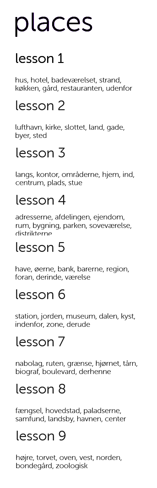

# Readme

<!-- TOC -->

* [1.1. Intro](#11-intro)
* [1.2. Run](#12-run)
* [1.3. Parse data](#13-parse-data)
* [1.4. Semi-manual data enriching](#14-semi-manual-data-enriching)

<!-- /TOC -->

## 1.1 Intro

Code and data to parse fandom (in this case, the Duolingo Danish course in English in Fandom).

Oriented to gather data from that platform and enrich it.

Enriching the data is semi-manual, as only some lessons are already in the Fandom platform.

The goal is to use programming skills to have an easy-learned vocabulary reference for Danish.

## 1.2 Run

Execute `scrapy crawl danish -O danish.json`

## 1.3 Parse data

Execute `python lib/arrs_to_cols.py`

## 1.4 Semi-manual data enriching

After that, each missing data was enriched with this flow:

1. Pass new lesson(s) in Duolingo to see next ones

2. The new lessons words were screenshotted in Duolingo Desktop for Windows

3. The screenshots were edited with GIMP (need to be automated with ImageMagick), resulting in something similar than this image:

.

4. It was performed an [OCR](https://www.onlineocr.net/es/) of those images, and then appended in the `danish_curated.csv` file.

5. Writing operations in the file were helped by VSCode multicursor insertions with mouse middle button.

6. The numeric references were added automatically with [Asuka.insertnumbers](https://marketplace.visualstudio.com/items?itemName=Asuka.insertnumbers) VSCode extension.

7. Additionally, a `danish_curated_anki.csv` was created for further conversion to ANKI format for that learning platform via [The csv2apkg tool](https://www.easy4u.tools/csv2apkg).
